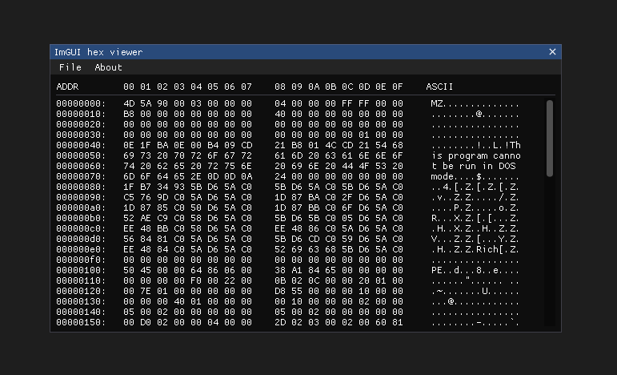
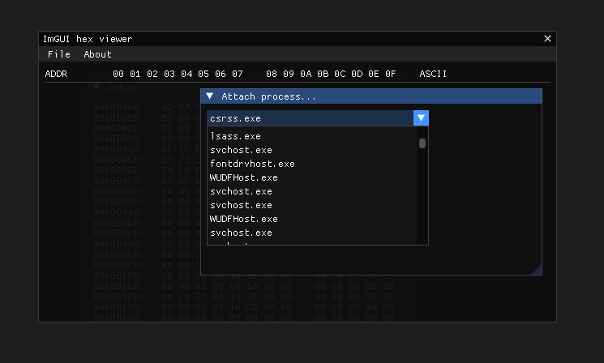
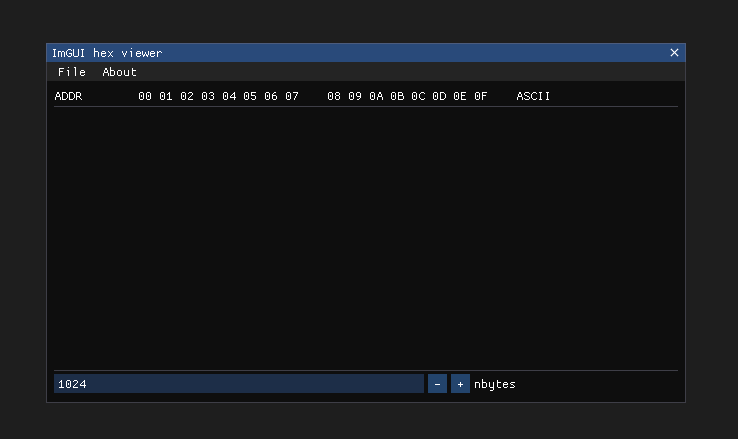

# ImGUI hex viewer

### Minimalistic hex viewer built using [ImGUI](https://github.com/ocornut/imgui) for learning purposes

## Features
- Opening files
- ~~Attaching processes~~ (not working for all processes)

## TODO
- Show opened file / attached process name somewhere
- Allow user to select the number of bytes to be displayed (1024 by default). I actually implemented that feature, but it was buggy (the hex view overlapped upon it):

## Thanks to
- The awesome [Dear ImGUI](https://github.com/ocornut/imgui) library
- The [gamehacking.academy](https://gamehacking.academy) website that taught me stuff about processes memory manipulation (even though my stuff is actually broken in that particular project)
- [cazz](https://www.youtube.com/@cazz) that made a video on implementing ImGUI and spared me some time firguring out how to do it the hard way
- [aaSSfxxx](aassfxxx.infos.st) that helped me with some issue
